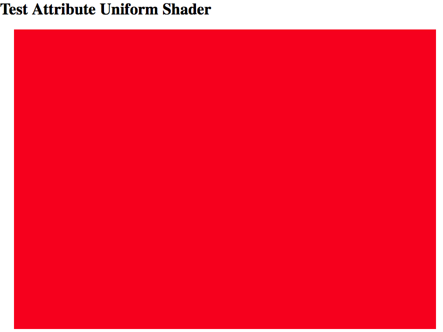
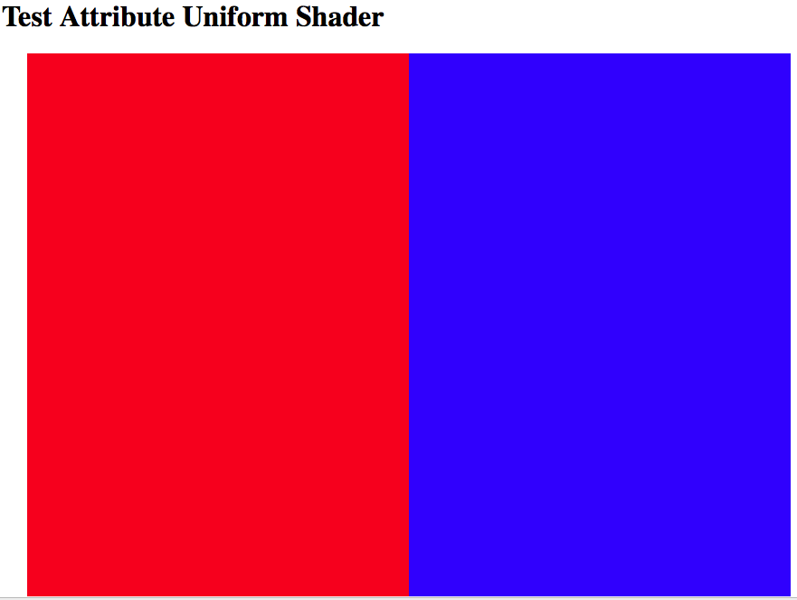

# AUShader : Attribute Uniform Shader Provider API For ThreeJS WebGL Rendering with ShaderMaterial

AUShader is a small light tool based on THREEJS to help you create custom webGL shader easily using ShaderMaterial and/or Buffer Geometry.

## Why AUShader ?

Three.js is a cross-browser JavaScript library/API used to create and display animated 3D computer graphics using WebGL. If you are a WebGL starter, please google <kbd>**threejs webGL tutorial**</kbd> and learn how to create **render**,**scene**,**camera** and **mesh**. AUShader allows us to create a custom mesh without touching the configuration for [ShaderMaterial][0bd50700] and [BufferGeometry][70535f04]. The **mesh** is the un object that we add to scene and render to screen.

> **AUShader simplifies the creation of material,geometry and it provides an easy way to create custom mesh.**


  [0bd50700]: https://threejs.org/docs/#api/materials/ShaderMaterial "ShaderMaterial"
  [70535f04]: https://threejs.org/docs/#api/core/BufferGeometry "BufferGeometry"


## How we create a simple mesh without ShaderMaterial ?

Here is the code example to create a square with red color.

```javascript
var planeGeometry = new THREE.PlaneGeometry(900,600,50,50);
var material      = new THREE.MeshBasicMaterial({color: 0xff0000});
var mesh          = new THREE.Mesh(planeGeometry, material);
```
The MeshBasciMaterial map a red color 0xff0000 directly to mesh. The result is:



What if you want left half image (mesh) has blur color at right half has red color ? You need to use [ShaderMaterial][0bd50700] !!!

> **ShaderMaterial and BufferGeometry give you full control of your mesh.**

--------------------------------------

## Quick Start

1) Download AUShader to somewhere:
```
git clone https://github.com/XianbinFramework/AUShader
```
2) Copy <kbd>AUShader/AUShader</kbd> to your project. If you don't use Typescript, you can remove all .ts file.

3) Import js files into your html file.

Import threejs , for exemple:
```html
<script src="http://threejs.org/build/three.min.js"></script>
```
Import AUShader:
```html
<script src="../AUShader/AUBase.js"></script>
<script src="../AUShader/AUAttribute.js"></script>
<script src="../AUShader/AUUniform.js"></script>
<script src="../AUShader/AUSampler.js"></script>
<script src="../AUShader/AUVarying.js"></script>
<script src="../AUShader/AUIndex.js"></script>
<script src="../AUShader/AUProvider.js"></script>
```

4 ) Create your application Typescript file. If you use javascript, you can watch examples at the end of this document.

### AU Variables

Before you start, you may know what is **Attribute**, **Uniform**, **Sampler(texture)** and **Varying** variables. Also what are ** Vertex shader function** and ** Fragment shader function**.

#### Declaration AU variables
In your application class , declare AU variables as properties of your class.

```java
leftColor  : AUUniform | any;
rightColor : AUUniform | any;
varyings   : AUVarying | any;
auProvider : AUProvider;
```

You can declare au variable without <kbd>  | any</kbd>, but the any type allows you to access data with <kbd> . </kbd> operator.

#### Create your application with AUProvider

In your class constructor :

```javascript
constructor(){
  // init au variables
  this.leftColor = new AUUniform({
    color  : new THREE.Vector4(1,0,0,1), //rgba  : red
    offset : new THREE.Vector4(0,0,0,0)
  });
  this.rightColor = new AUUniform({
    color : new THREE.Vector4(0,0,1,1), //rgba : blue
    offset: new THREE.Vector4(0,0,0,0)
  });
  this.varyings = new AUVarying({
    vUv: new THREE.Vector2(0,0)
  })
  // Init AU provider
  this.auProvider = new AUProvider();
  this.auProvider.configureModel(this);
  this.auProvider.commit();
  // create image mesh
  var planeGeometry = new THREE.PlaneGeometry(900,600,50,50);
  var material      = this.auProvider.material;
  var mesh          = new THREE.Mesh(planeGeometry, material);
}
```
- Use configureModel function to tell AUProvider where to look for AU variables and vertex/fragment function.

- Call commit() to create material and geometry. You can use custom material with threejs standard geometry like in this example.


#### Create vertex function and fragment function

In the same class, outside of constructor, create 2 function like this.

```javascript
auVertexMain():string{
  var vertFunc:string = (`
      vUv = uv;
    `
  );
  return vertFunc;
}
auFragmentMain():string{
  var fragFunc:string = (`
    if(vUv.x < 0.5){
      auColor += leftColor.color + leftColor.offset;
    } else {
      auColor += rightColor.color + rightColor.offset;
    }
    `
  );
  return fragFunc;
}
```
- AUProvider searches these 2 functions by name, so make sure you write the same name.

- Each function return a string like OpenGL shader language.

- <kbd>** auPosition ** </kbd> is reserved for vertex function like <kbd>** position ** </kbd> variable in WebGL. And it's the final position of your vertex. If you use threejs standard geometry like in this example, you have <kbd>** auPosition = vec4(position,1.0) ** </kbd> by default.

- <kbd>** auColor ** </kbd> is reserved for fragment function, it's the final color of your pixel. The default value is red  :<kbd>** auColor = vec4(1.0,0.0,0.0,1.0) ** </kbd>.

Then you got a double color image on your screen:


#### Change uniform value
In your update() function which excute every frame :

```javascript
update(){
  this.leftColor.offset.y += 0.01;
  if(this.leftColor.offset.y > 1) this.leftColor.offset.y = 0;
}
```
Then the red color in the left will change from red to yellow, and return back to red. The demo application can be found in <kbd>AUShader/DemoQuickStart</kbd>. Doule click QuickStart.html if you use Safari. If you use Chrome, you may need to setup a web serveur(for example use MAMP software).

-------------------------------------------

## **Advanced Usage**

### AUProvider

#### AUProvider is re-useable
Each time <kbd>commit() </kbd> is called, AUProvider will create material and/or geometry for the current state of giving model. That means you can commit first time, and change the AU Variable, then commit second time, you can get a new material.

```javascript
...
this.auProvider.configureModel(this);
this.auprovider.commit();
let material1 = this.auProvider.material;
// change or re-create leftColor
this.leftColor.color.x = 0;
this.auProvider.commit();
let material2 = this.auProvider.material;
...
```

#### AUProvider can be used for more than one model.
In this example, the auProvider is create in the model!!, so we call configureModel(this) to tell where provider need to search AU variables and vertex/fragment functions. But it's better to move all this part to a separate class like model and re-use it.

```javascript
class Square {
  ...
  constructor(){
    this.leftColor = new AUUniform(...)
    ...
    auFragmentMain():string{...}
    ...
  }
}

class Circle {
  ...
  constructor(){
    this.leftColor = new AUUniform(...)
    ...
    auFragmentMain():string{...}
    ...
  }
}

```

Then in your main application, configure AUProvider to these model.

```javascript
...
let square = Square();
let circle = Circle();
this.auProvider.configureModel(square);
this.auProvider.commit();
square.material = this.auProvider.material;
this.auProvider.configureModel(circle);
this.auProvider.commit();
circle.material = this.auProvider.material;
...
```

-------------------------------------------------------------

### AU Variables and vertex/fragment functions.

AUShader has 4 class (used as variable) : **AUAttribute**, **AUUniform**, **AUSampler** and **AUVarying**. And 4 optional functions to provide vertex/fragment functions. we use **AUIndex** to set vertex index for attributes, the AUIndex is not complicated, you can see example at the end of this document.

```java
interface AUProviderDelegate{
  auVertexMain?()    :string;
  auFragmentMain?()  :string;
  auVertexGlobal?()  :string;
  auFragmentGlobal?():string;
}
```
And you can use these variable types to create AU variables:

```javascript
type AUAvaibleType  = THREE.Vector4 | THREE.Vector3 | THREE.Vector2 | THREE.Matrix4 | THREE.Matrix3 | THREE.Texture | number;
```


#### AUAttribute
AUAttribute is used to set attribute for BufferGeometry, it is Unlike others AU variables, the AUAttribute must use as an array, because at least 3 vertex to render a triangle. According to threejs documentation :

> This makes BufferGeometry best-suited for static objects where you don't need to manipulate the geometry much after instantiating it.

So :

- You can't change attribute variable's value in CPU program.
- You read attribute value in shader program like structure. Like uniform in QuickStart example.
- You can change attribute value in shader program for calculation, because in the shader program, it's re bind real attribute value to the structure attribute value.
- Can't use <kbd> THREE.Texture </kbd> to create AUAttribute.


#### AUUniform
AUUniform is created both vertex function and fragment function, and it's shared between each pixel calculation. So:

- You can't change uniform variable's value in shader program.
- You can access AUUniform variable in the shader program by using the same structure like : leftColor.color, but you can't change uniform value in the shader.
- You can change uniform's value in CPU program.

#### AUVarying
AUVarying is used to transfer value between vertex function and fragment function, what ever you set init value when create AUVarying, it has no value by default.

- You can change varying variable value in shader program, it's what we need it as varying.
- You can access AUVarying variable in shader program only by name, because WebGL doesn't support varying structure.
- You can't change varying variable value in CPU program, because varying variable only exist in shader program.
- Can't use <kbd> THREE.Texture </kbd> to create AUAttribute.

#### AUSampler
AUSampler is used to read Texture, it only exist in fragment function.

- You can't change AUSampler in shader program.
- You can access AUSampler variable in shader program only by name, because WebGL doesn't support sample2D structure.
- You can change AUSampler texture in CPU program, don't forget to set needsupdate = true.
- Only <kbd> THREE.Texture </kbd> is available.

#### auVertexMain()
main vertex function, the final vertex position must set to <kbd>**auPosition**</kbd>.

#### auVertexGlobal()
Declare global function and variables outside of main vertex function.

#### auFragmentMain()
main fragment function, the final pixel color must set to <kbd>**auColor**</kbd>.

#### auFragmentGlobal()
Declare global function and variables outside of main fragment function.


-----------------------------------------------

### Examples

[QuickStart][23c73827]

  [23c73827]: https://github.com/XianbinFramework/AUShader/DemoQuickStart "QuickStart"

----------------------------------------------

### Thank you for

- Thomas Le Coz : WebGL support


--------------------

### TODO

- [X] QuickStart demo
- [ ] ImageTexture demo for image texture and video texture and global shader function.
- [ ] Geometry demo for AUAttribute and AUIndex example.
- [ ] Test units
- [ ] Global default functions : rotateZ(), ColorMatrix()....
